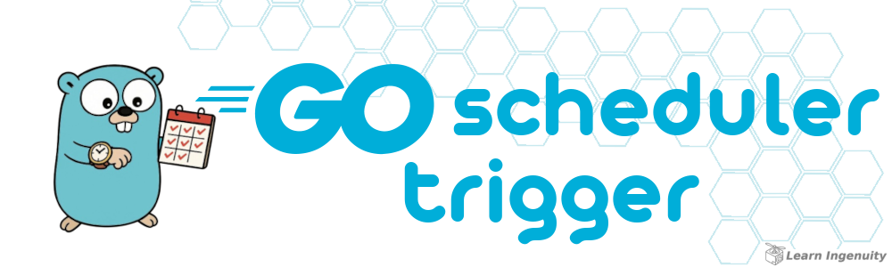

<!-- 
    icons by:
    https://devicon.dev/
    https://simpleicons.org/
-->
          

<!-- 
  

-->

 <!-- --> 

## 🕸️ Redes

 

---

## 📁 O Projeto

### ⤴️ Índice

__[Go Scheduler Trigger](#header)__ 
  1.  ⤴️ [Índice](#index)
  2.  📖 [Sobre](#about)
  3.  💻 [Rodando o Projeto](#run)
      - 🌐 [Ambiente](#environment)
      - 🐋 [Conteinerizado](#run-containerized)
      - ✍️ [Endpoints e Uso](#run-use)
  4.  🔢 [Versões](#versions)
  5.  📊 [Diagramas](#diagrams)
      - 📈 [ER](#diagrams-erchart)
  6.  🤖 [Uso de IA](#ia)
  7.  🏁 [Conclusão](#conclusion)

### 📖 Sobre

`go-scheduler-trigger` é um estudo para agendador reativo desenvolvido em `Go`, projetado para disparar mensagens e notificações quase em tempo real, sem depender de cron jobs ou polling contínuo.

O projeto resolve o problema de sistemas que precisam enviar alertas, emails ou executar tarefas temporizadas com precisão e eficiência, eliminando a complexidade e o overhead de soluções tradicionais baseadas em agendamento recorrente.

Ao utilizar uma abordagem baseada em eventos, ele garante que cada mensagem seja acionada exatamente no momento previsto, proporcionando uma solução simples, confiável e altamente escalável para notificações e tarefas programadas.

 

[⤴️ de volta ao índice](#index)

---

### 💻 Rodando o Projeto

#### 🌐 Ambiente

`Docker` e `Docker Compose` são necessários para rodar a aplicação de forma containerizada, e é fortemente recomendado utilizá-los para rodar o banco de dados e demais dependências localmente. Siga as instruções abaixo caso não tenha esses softwares instalados em sua máquina:

- &nbsp;&nbsp;[Instalando Docker](https://docs.docker.com/engine/install/)
- &nbsp;&nbsp;[Instalando Docker Compose](https://docs.docker.com/compose/install/)

 

. . . . . . . . . . . . . . . . . . . . . . . . . . . .

 

#### 🐋 Containerizado 

 

. . . . . . . . . . . . . . . . . . . . . . . . . . . .

 

#### ✍️ Endpoints e Uso

 

[⤴️ de volta ao índice](#index)

---

### 📊 Diagramas

#### 📈 ER

**TODO**

 

[⤴️ de volta ao índice](#index)

---

### 🔢 Versões

As tags de versões estão sendo criadas manualmente a medida que o projeto avança. Cada tarefa é desenvolvida em uma branch a parte (Branch Based, [feature branch](https://www.atlassian.com/git/tutorials/comparing-workflows/feature-branch-workflow)) e quando finalizadas é gerada tag e mergeadas em main.

Para obter mais informações, consulte o [Histórico de Versões](./CHANGELOG.md).

 

[⤴️ de volta ao Index](#index)

---

### 🤖 Uso de IA

A figura do cabeçalho nesta página foi criada com a ajuda de inteligência artificial e um mínimo de retoques e construção no Gimp 

__Os seguintes prompts foram usados para criação no  [Bing IA:](https://www.bing.com/images/create/)__

  
<b>Gopher ocupado com agendamentos</b>

"gopher azul, simbolo da linguagem golang o mais proximo possivel do mascote, olhando para um relogio de pulso na sua mao e na outra um calendario de compromissos, estilo cartoon, historia em quadrinhos, fundo branco chapado para facilitar remoção"<b>(sic)</b>

 

IA também é utilizada em minhas pesquisas e estudos como ferramenta de apoio; no entanto,  __artes e desenvolvimento são, acima de tudo, atividades criativas humanas. Valorize as pessoas!__

Contrate artistas para projetos comerciais ou mais elaborados e aprenda a ser engenhoso!

 

[⤴️ de volta ao índice](#index)

---

### 🏁 Conclusão

**TODO**

 

Este desafio me permite consolidar conhecimentos e identificar pontos cegos para aprimoramento. Continuarei trabalhando para evoluir o projeto e expandir minhas habilidades.

 

[⤴️ de volta ao índice](#index)

---

 

>  _"Lifelong Learning & Prosper"_
>   
>  _Mr. Spock, maybe_   🖖🏾🚀

